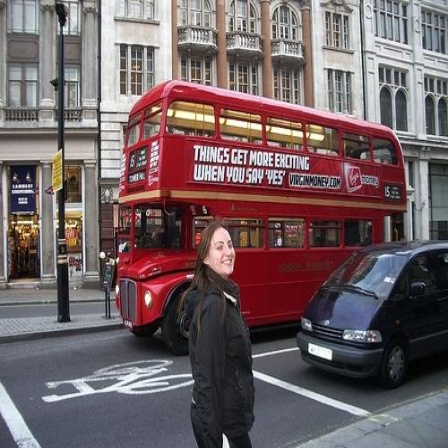

# Qwen2.5-VL-3B-Instruct.axera
Qwen2.5-VL-3B-Instruct DEMO on Axera

- 预编译模型下载 [Huggingface](https://huggingface.co/AXERA-TECH/Qwen2.5-VL-3B-Instruct)
- 图片理解模型如需自行转换请参考[模型转换](/model_convert/README.md)
- 视频理解模型如需自行转换请参考[模型转换](/model_convert/README_VIDEO.md)
- [c++ demo](cpp)

## 支持平台

- [x] AX650N

## 模型转换

[模型转换](./model_convert/README.md)

## 上板部署

- AX650N 的设备已预装 Ubuntu22.04
- 以 root 权限登陆 AX650N 的板卡设备
- 链接互联网，确保 AX650N 的设备能正常执行 `apt install`, `pip install` 等指令
- 已验证设备：AX650N DEMO Board、爱芯派Pro(AX650N)、爱芯派2(AX630C)

### Python API 运行

#### Requirements

将 npu_python_llm 拷贝到具备 python 环境的 AX650N 开发板或者 爱芯派Pro 上  
执行以下命令安装pyaxengine
```
cd {your path to npu_python_llm}/axengein 
pip install -e .
``` 

#### 添加环境变量

将以下两行添加到 `/root/.bashrc`(实际添加的路径需要自行检查)后，重新连接终端或者执行 `source ~/.bashrc`

```
export LD_LIBRARY_PATH={your path to npu_python_llm}/engine_so/:$LD_LIBRARY_PATH
``` 

#### 运行

在开发板上运行命令

```
python3 infer.py
```  

#### 示例  
**图片理解示例1**  
**输入**  
```
messages = [
                {
                    "role": "user",
                    "content": [
                        {
                            "type": "image",
                            "image": "demo.jpg"
                        },
                        {"type": "text", "text": "Describe this image."},
                    ],
                }
            ]
```
  

**输出**  
```
The image depicts a serene beach scene with a person and a dog sitting on the sand. The person is wearing a plaid shirt and black pants, while the dog is wearing a harness. The background features the ocean with gentle waves and a clear sky, suggesting a calm and peaceful day at the beach. The lighting indicates that it might be either early morning or late afternoon, adding to the tranquil atmosphere.<|im_end|
```
**图片理解示例2**  
**输入**  
```
messages = [
                {
                    "role": "user",
                    "content": [
                        {
                            "type": "image",
                            "image": "demo1.jpg"
                        },
                        {"type": "text", "text": "Describe this image."},
                    ],
                }
            ]
```
  
**输出**  
```
The image depicts a street scene in an urban area, likely in a city with historical architecture. The focal point of the image is a red double-decker bus, which is a common sight in many cities, particularly in the United Kingdom. The bus is parked on the side of the street and is adorned with an advertisement that reads, "Things get more exciting when you say yes." The advertisement is for Virgin Money, a financial services company.

In front of the bus, there is a woman standing on the sidewalk. She is wearing a black jacket and appears to be smiling, looking towards the camera. Her presence adds a human element to the scene, providing a sense of scale and perspective.

The street itself is lined with buildings that have a classic architectural style, featuring large windows and ornate details. The buildings appear to be made of stone or brick, contributing to the historic feel of the area. There is also a black car parked on the street, partially visible behind the woman.

The street is marked with white lines, indicating parking or pedestrian areas. The overall atmosphere of the image suggests a calm, possibly early morning or late afternoon, given the lighting and the lack of heavy traffic.

In summary, the image captures a moment in a historic urban setting with a red double-decker bus, an advertisement for Virgin Money, and a smiling woman standing on the sidewalk. The scene is characterized by classic architectural buildings and a calm street environment.<|im_end|>
```

**视频理解示例**

在开发板上运行命令

```
python3 infer_video.py
```  
**输入**
```
    messages = [
        {
            "role": "user",
            "content": [
                {
                    "type": "video",
                    "video": paths,
                    "max_pixels": 308 * 308,
                    "fps": 1.0,
                },
                {"type": "text", "text": "描述一下这个视频的内容"},
            ],
        }
    ]
```

(视频内容待补充)

**输出**  
```
视频显示的是一个城市街道的场景。时间戳显示为2月26日，地点是xxx。视频中，一名穿着深色外套和牛仔裤的男子正在推着一个行李箱。突然，他似乎被什么东西绊倒，整个人向前扑倒，行李箱也随之倒地。
男子试图站起来，但似乎有些吃力。背景中可以看到一些行人和车辆，以及一个广告牌，上面有一个绿色的树形图案。整个场景看起来是在白天拍摄的，光线充足。<|im_end|>
```

## 模型速度  
| Vision Encoder | Time to First Token (ms) |
|------|------|
| U16 PTQ | 780  | 
| Mixed PTQ |      |

Language Model Decode: 6.3 tokens/s .

## 关于 mrope
### 一、Qwen2.5-VL 中的 multimodal_rotary_embedding（mrope）和 rope 的区别  
1. mrope的 position id 是三维的（temporal，height，width），rope 是一维的
2. mrope在使用的时候会将三维分channel （16,24,24）选出来合成一维，形式和rope相同。

### 二、axmodel 中 mrope的使用方法  
mrope 的 position_id 是和图片尺寸，text 长度相关的，但是在编译 LLM 的部分又不希望固化这些参数。  
所以在实现上:  
模型中保存的 cos_param 和 sin_param 和 rope 的相同。  
在 prefill 阶段推理的时候，会传入三维的 position_id，模型中以 position_id 作为 index 去 gather cos_param 和 sin_param 得到 mrope 的 cos_param 和 sin_param。然后模型中会将三维 embedding 按 channel 合成一维。  
在 decode 阶段，mrope 因为三个维度相同，所以其实和 rope 等价，只是起始 position id 值不再是 prefill token length 加一，而是 prefill 阶段 最大position id 值加一。  
示例代码见 `python/infer.py`。     

## 技术讨论

- Github issues
- QQ 群: 139953715
